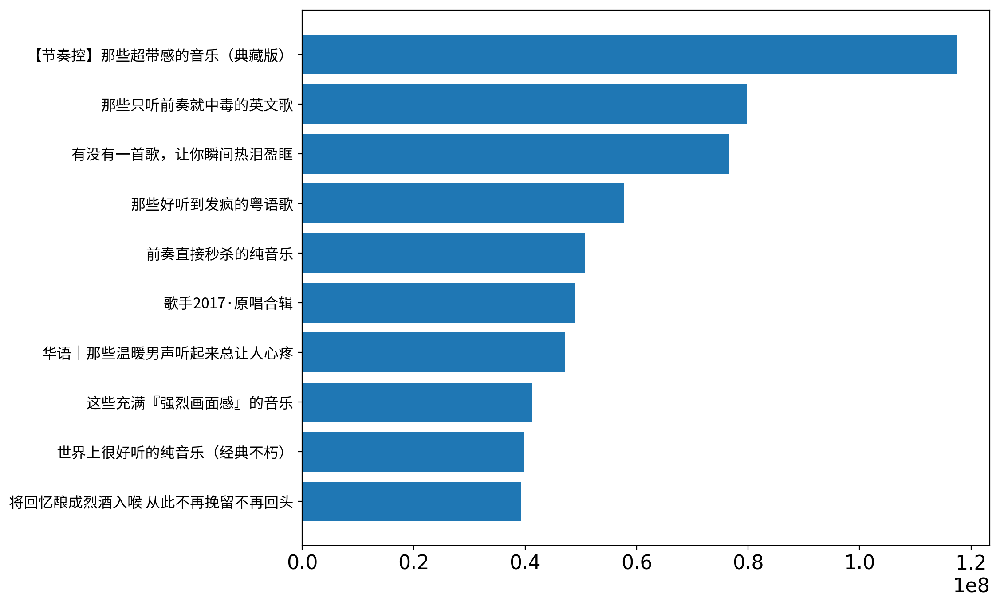
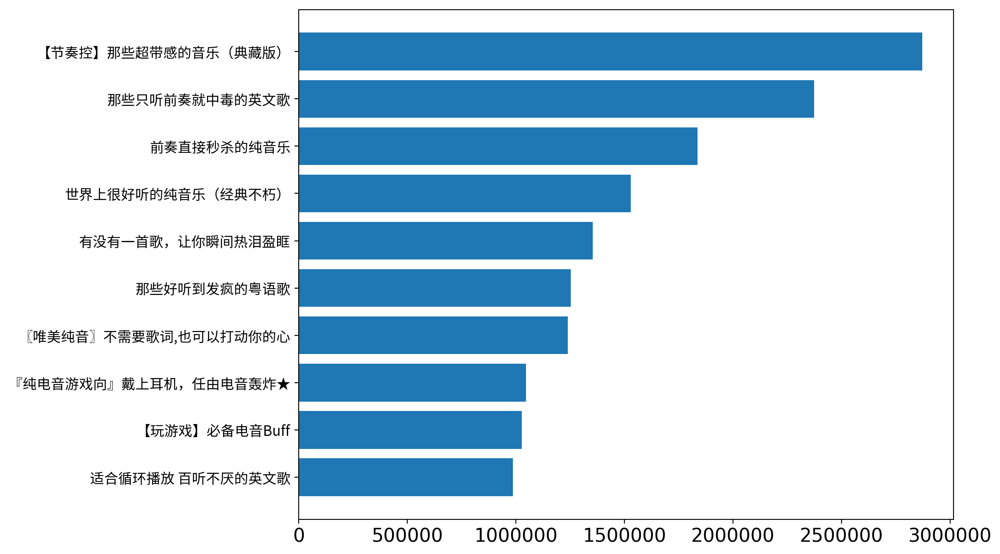
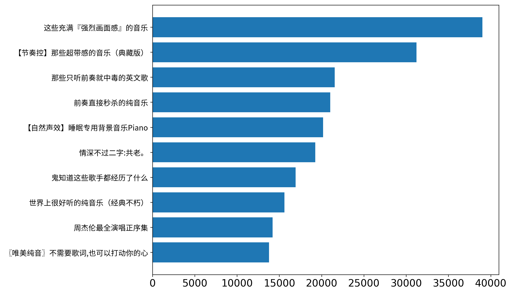
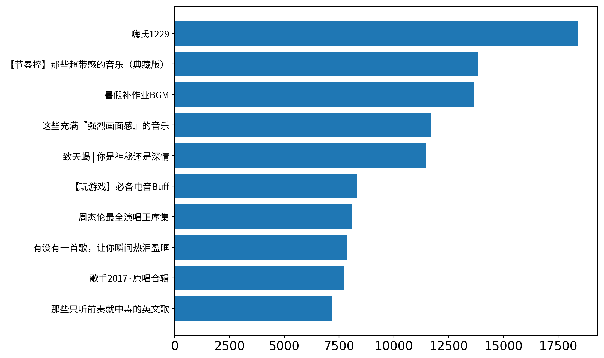

## 数据简单展示

- 数据抓取时间：2018-01-01 ~ 2018-01-02
- 共抓取23159张歌单，2478972条歌曲信息
- 数据展示通过横状条形图展示数量排行，用词云展示文本词频
- 中文字体来源：https://github.com/adobe-fonts/source-han-sans/tree/release/OTF/SimplifiedChinese


```python
import pandas as pd
import matplotlib.pyplot as plt
from matplotlib.font_manager import FontProperties
from matplotlib.pylab import rcParams
from wordcloud import WordCloud

% matplotlib inline
rcParams['figure.figsize'] = 10, 8
rcParams['figure.dpi'] = 200
rcParams['font.size'] = 16

# wordcloud 中文字体
wc_font = r"../SourceHanSansSC-Regular.otf"
# matplotlib 中文字体
mpl_font = FontProperties(fname=r"../SourceHanSansSC-Regular.otf", size=12)


```


```javascript
%%javascript
IPython.OutputArea.prototype._should_scroll = function(lines){
    return false
}

```


    <IPython.core.display.Javascript object>


```python
# helper function

def top_ranking_barh(df, col_show, col_count, top=10):
    df = df.sort_values(by=col_count, ascending=False).reset_index(drop=True)
    df_top = df.iloc[:top]
    
    fig, ax = plt.subplots()
    for label in ax.get_yticklabels():
        label.set_fontproperties(mpl_font)
    
    y_pos = range(len(df_top)-1, -1, -1)
    plt.barh(y_pos, df_top[col_count].values)
    plt.yticks(y_pos, df_top["title"])

def word_colud_freq(df, col_text):
    text = df[col_text].str.cat(sep="")
    
    # lower max_font_size
    wordcloud = WordCloud(max_font_size=30, font_path=wc_font, background_color="white").generate(text)
    plt.figure()
    plt.imshow(wordcloud, interpolation="bilinear")
    plt.axis("off")
            
    
```


```python
# read data
play_list = pd.read_csv("../data/play_list.csv")
song = pd.read_csv("../data/song.csv")
play_list = play_list.drop("pk_play_list_id", axis=1).drop_duplicates()
song = song.drop("pk_song_id", axis=1).drop_duplicates()
play_list["create_time"] = pd.to_datetime(play_list["create_time"])
play_list.info()
print("-" * 80)
song.info()
```

    <class 'pandas.core.frame.DataFrame'>
    Int64Index: 23159 entries, 0 to 23168
    Data columns (total 8 columns):
    title          23159 non-null object
    create_time    23159 non-null datetime64[ns]
    collect        23159 non-null int64
    share          23159 non-null int64
    comment        23159 non-null int64
    tag            23159 non-null object
    description    20296 non-null object
    play_count     23159 non-null int64
    dtypes: datetime64[ns](1), int64(4), object(3)
    memory usage: 1.6+ MB
    --------------------------------------------------------------------------------
    <class 'pandas.core.frame.DataFrame'>
    Int64Index: 2478972 entries, 0 to 2487443
    Data columns (total 5 columns):
    list_title    object
    song_title    object
    duration      object
    singer        object
    album         object
    dtypes: object(5)
    memory usage: 113.5+ MB
    

### 歌单播放量排行 top 10


```python
top_ranking_barh(play_list, "title", "play_count", 10)
```





### 歌单收藏排行 top 10


```python
top_ranking_barh(play_list, "title", "collect", 10)
```





### 歌单分享排行 top 10


```python
top_ranking_barh(play_list, "title", "share", 10)
```





### 歌单评论排行 top 10 


```python
top_ranking_barh(play_list, "title", "comment", 10)
```





### 歌单综合排行 top 100 标签词云


```python
play_list = play_list.sort_values(by=["collect", "share", "comment", "play_count"], ascending=False).reset_index(drop=True)
df_top = play_list.iloc[:100]
word_colud_freq(df_top, "tag")
```


### 歌单标题词云


```python
word_colud_freq(play_list, "title")
```


### 歌单描述词云 


```python
word_colud_freq(play_list, "description")
```


### 歌名出现频率词云


```python
word_colud_freq(song, "song_title")
```


### 歌手词云


```python
word_colud_freq(song, "singer")
```


### 专辑词云


```python
word_colud_freq(song, "album")
```


